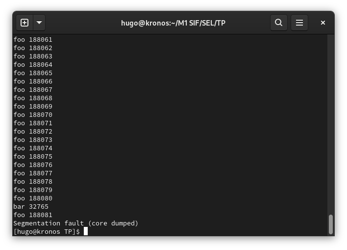

# Rendu TPs de SEL

*Hugo Boulier & Ludmila Courtillat--Piazza*

## Avancement des challenges

Lors de la dernière séance nous vous avons présenté le challenge 2 que vous avez validé mais auquel vous avez apporté deux remarques :

- Nous ne sauvegardions pas tous les registres mais seulement ceux dans lesquels notre traçant avait écrit directement (`rsp`, `rax` et `rdi`).  
- Notre tracé s'interrompt après un seul appel de fonction lorsqu'il reprend la main. Cet appel nous permet de constater que son code et ses registres ont visiblement été rétablis tels qu'ils étaient avant l'appel inopiné à `bar` (la fonction appelée inopinément).

Vous nous avez suggéré de régler le premier point en espérant que cela solutionne le second. C'est ce que nous avons fait (via un appel à `memcpy`), mais malheureusement, cela n'a pas eu les effets attendus. Actuellement, notre tracé continue de s'interrompre au bout d'un appel de fonction après avoir repris la main :

Nous avons également écrit le code du challenge 3 tel que nous avons compris qu'il devait l'être, en nous appuyant sur le sujet du TP (ce code compile sans erreurs via un `make challenge3`). N'ayant pas fait le challenge 4, nous n'avons pas eu le loisir de le tester, mais nous souhaitions présenter notre compréhension de ce challenge.

## Tests des TP

Les TPs ont été testés à l'aide de `print` des informations recueillies lors des étapes clés des différents challenges (pid, adresses... ). Nous avons vérifié manuellement l'exactitude de ces informations.

Nous avons par ailleurs fait appel à de nombreux tests et vérifications d'erreurs tout au long du code rédigé, notamment après chaque appel système.

Dans le cas du challenge 2 en particulier, des `print` récurrents au sein de la fonction `foo` (compteur et adresse) nous permettent d'observer son état mémoire.
